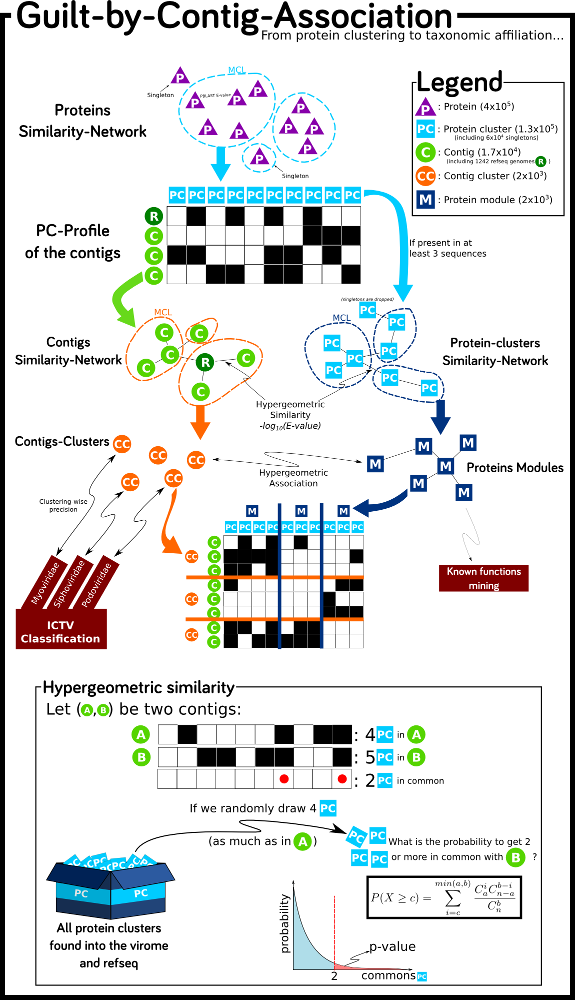

.. vcontact documentation master file, created by
   sphinx-quickstart on Sat May 24 15:04:25 2014.
   You can adapt this file completely to your liking, but it should at least
   contain the root `toctree` directive.

Viral Contig Automatic Cluster Taxonomy : VContACT
====================================

VContact is a tool to perform Guilt-by-contig-association automatic classification of viral contigs.

.. toctree::
   :maxdepth: 4

Tutorial and documentation 
--------
- The :ref:`tutorial` will help you to quickly get started
- The :ref:`scripts` documentation is a more formal description of the commands you can use. 
- The API documentation (:ref:`modindex`) give a description of all functions if you want to dive in the code and improve it.

The method:
------------

References:
------------
- **Automatic taxonomic affiliation via "Guilt by contig association" in viral metagenomic data**. Guilhem Doulcier, *Master degree internship report* 2014.
- **Reticulate Representation of Evolutionary and Functional Relationships between Phage Genomes**.  Gipsi Lima-Mendez, Jacques Van Helden,  and Ariane Toussaint and Raphael Leplae. *Mol Bio. Evol.* 2008.

Licence:
--------

    This program is free software: you can redistribute it and/or modify
    it under the terms of the GNU General Public License as published by
    the Free Software Foundation, either version 3 of the License, or
    (at your option) any later version.

    This program is distributed in the hope that it will be useful,
    but WITHOUT ANY WARRANTY; without even the implied warranty of
    MERCHANTABILITY or FITNESS FOR A PARTICULAR PURPOSE.  See the
    GNU General Public License for more details.

    You should have received a copy of the GNU General Public License
    along with this program.  If not, see http://www.gnu.org/licenses/.
